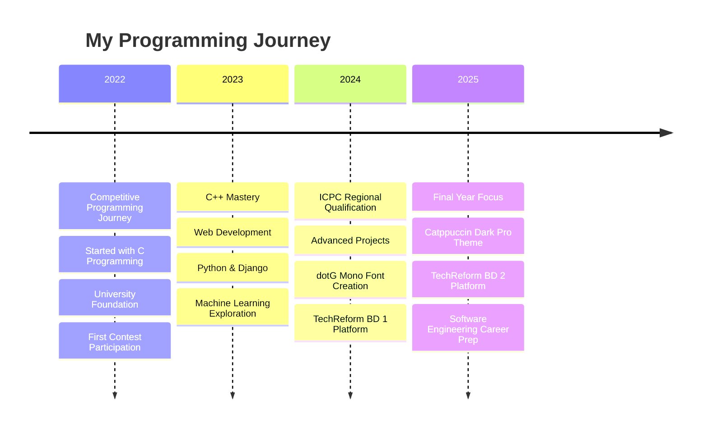

<div align="center">

# 👋 Hi! I'm **Sharif Md. Yousuf**

</div>

<div align="center">

[](https://git.io/typing-svg)

</div>

<div align="center">

[](https://github.com/SharifdotG)
[](https://github.com/SharifdotG)
[](https://github.com/SharifdotG)

</div>

---

## 🎯 **About Me**

> 🏆 **Competitive Programmer** | 🎓 **CSE Final Year Student** | 🚀 **Aspiring Software Engineer**

🌟 Currently pursuing my **Bachelor's in Computer Science & Engineering** at **University of Asia Pacific** (4th & Final Year)
🏆 **ICPC Asia Dhaka Regional 2024** Onsite Participant
⭐ **Specialist** on Codeforces | **3 Stars** on CodeChef (Division 2) | **Top 10** in Kattis Bangladesh Ranking
🎨 Creator of **dotG Mono Font** & **Catppuccin Dark Pro** VS Code Theme
💼 Passionate about solving complex problems and building innovative solutions

```typescript
const sharif = {
    location: "Dhaka, Bangladesh 🇧🇩",
    education: "CSE @ University of Asia Pacific",
    currentFocus: ["Competitive Programming", "Software Engineering", "Web Development"],
    askMeAbout: ["Algorithms", "Data Structures", "Problem Solving", "Font Design"],
    funFact: "I love creating tools that make developers' lives easier! ✨"
};
```

---

## 🏆 **Competitive Programming Achievements**

<div align="center">

| 🏅 **Platform** | 🌟 **Achievement** | 📊 **Stats** |
|:---:|:---:|:---:|
| **Codeforces** | Specialist | [](https://codeforces.com/profile/SharifdotG) |
| **CodeChef** | 3 Stars (Div 2) | [](https://www.codechef.com/users/sharifdotg) |
| **Kattis** | Top 10 Bangladesh | [](https://open.kattis.com/users/sharifdotg) |
| **ICPC** | Regionalist 2024 | [](https://icpc.global/ICPCID/3261LLIXC2AL) |

</div>

<div align="center">

[](https://codeforces.com/profile/SharifdotG)

</div>

---

## 🛠️ **Tech Arsenal**

<div align="center">

### 💻 **Programming Languages**


### 🌐 **Web Development**


### 🗄️ **Databases & Tools**


</div>

---

## 🚀 **Featured Projects**

### 🏆 **[SharifdotG's CodeVault](https://github.com/SharifdotG/SharifdotG-s-CodeVault)**
>
> 🧩 **1300+ Problems Solved** | 🌍 **25+ Online Judges** | 💻 **Multiple Languages**

The ultimate coding problem solutions repository! From Codeforces to LeetCode, this vault contains optimized solutions in C, C++, Java, Python, and Rust. Perfect for competitive programmers and interview preparation.


---

### 🛒 **[TechReform BD 2](https://github.com/SharifdotG/TechReform-BD-2)**
>
> 🖥️ **E-Commerce Platform** | 🏗️ **PC Builder Tool** | 💰 **Fair Pricing Model**

Revolutionary e-commerce platform for PC components in Bangladesh. Features include interactive PC builder, real-time compatibility checking, transparent pricing, and comprehensive product management.


**Key Features:**

- 🛒 Complete e-commerce solution with cart & checkout
- 🖥️ Interactive PC builder with compatibility validation
- 💰 MSRP-aligned transparent pricing
- 📱 Modern responsive design with dark/light themes

---

### 🔤 **[dotG Mono](https://github.com/SharifdotG/dotG-Mono)**
>
> ✨ **Custom Monospace Font** | 🎨 **Iosevka-based Design** | 🔤 **Nerd Font Support**

My personal take on the popular Iosevka font family, optimized for programming with enhanced readability and unique character styling. Includes full Nerd Font support with 54 TTF files.


**Features:**

- 🎯 Optimized for programming & terminal use
- 🔤 Unique character styling and ligature support
- 📦 54 font variants (Regular, Bold, Italic, etc.)
- 🛠️ Full Nerd Font integration for icons

---

### 🎨 **[Catppuccin Dark Pro](https://github.com/SharifdotG/Catppuccin-Dark-Pro)**
>
> 🌙 **VS Code Theme** | 🎨 **Catppuccin + One Dark Pro** | ✨ **190+ Token Rules**

The perfect fusion of Catppuccin Mocha's elegant UI with One Dark Pro's battle-tested syntax highlighting. Features ultra-flat design and comprehensive semantic highlighting for 15+ programming languages.


**Highlights:**

- 🌙 Catppuccin Mocha UI with borderless design
- 💡 190+ token rules for perfect syntax highlighting
- 🧠 15+ semantic tokens for intelligent code understanding
- 🎨 WCAG-compliant color science for reduced eye strain

---

## 📊 **GitHub Analytics**

<div align="center">


</div>

<div align="center">

[](https://git.io/streak-stats)

</div>

<div align="center">

[](https://github.com/ashutosh00710/github-readme-activity-graph)

</div>

---

## 🏆 **Achievements & Trophies**

<div align="center">

[](https://github.com/ryo-ma/github-profile-trophy)

</div>

---

## 📚 **Learning Journey**



---

## 🤝 **Connect With Me**

<div align="center">

[](https://www.linkedin.com/in/sharifdotg/)
[](https://twitter.com/SharifdotG)
[](https://www.facebook.com/SharifdotG)
[](https://instagram.com/sharifdotg)
[](https://reddit.com/user/SharifdotG)

### 🎯 **Competitive Programming Profiles**

[](https://codeforces.com/profile/SharifdotG)
[](https://www.codechef.com/users/sharifdotg)
[](https://leetcode.com/SharifdotG/)
[](https://www.hackerrank.com/SharifdotG)
[](https://www.kaggle.com/sharifdotg)

</div>

---

## 💝 **Support My Work**

<div align="center">

If you find my projects helpful or enjoy my contributions to the developer community, consider supporting my work!

[](https://buymeacoffee.com/SharifdotG)

</div>

---

## 💭 **Random Dev Quote**

<div align="center">


</div>

---

<div align="center">

### 🌟 **"Code is like humor. When you have to explain it, it's bad."**

**Thank you for visiting my profile! Let's build something amazing together! 🚀**

---

⭐ **Don't forget to star repositories you find interesting!**
🤝 **Open to collaborations and interesting projects**
📧 **Feel free to reach out for any opportunities or discussions**

</div>

---

<div align="center">

**Made with ❤️ by Sharif Md. Yousuf**
*Turning Coffee into Code since 2022* ☕→💻

</div>
